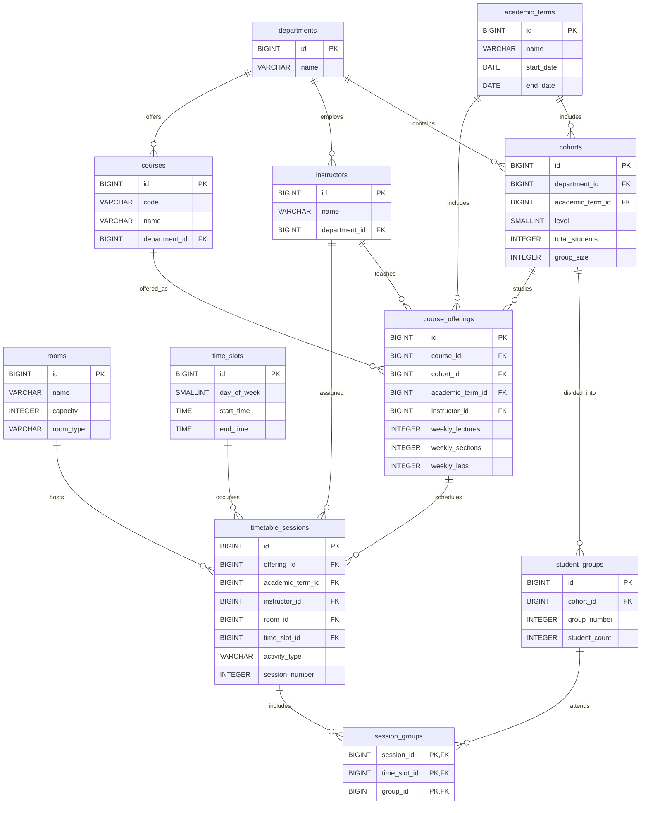

# University Database ERD

```mermaid
erDiagram
    departments {
        BIGINT id PK
        VARCHAR name
    }

    academic_terms {
        BIGINT id PK
        VARCHAR name
        DATE start_date
        DATE end_date
    }

    cohorts {
        BIGINT id PK
        BIGINT department_id FK
        BIGINT academic_term_id FK
        SMALLINT level
        INTEGER total_students
        INTEGER group_size
    }

    instructors {
        BIGINT id PK
        VARCHAR name
        BIGINT department_id FK
    }

    courses {
        BIGINT id PK
        VARCHAR code
        VARCHAR name
        BIGINT department_id FK
    }

    rooms {
        BIGINT id PK
        VARCHAR name
        INTEGER capacity
        VARCHAR room_type
    }

    time_slots {
        BIGINT id PK
        SMALLINT day_of_week
        TIME start_time
        TIME end_time
    }

    student_groups {
        BIGINT id PK
        BIGINT cohort_id FK
        INTEGER group_number
        INTEGER student_count
    }

    course_offerings {
        BIGINT id PK
        BIGINT course_id FK
        BIGINT cohort_id FK
        BIGINT academic_term_id FK
        BIGINT instructor_id FK
        INTEGER weekly_lectures
        INTEGER weekly_sections
        INTEGER weekly_labs
    }

    timetable_sessions {
        BIGINT id PK
        BIGINT offering_id FK
        BIGINT academic_term_id FK
        BIGINT instructor_id FK
        BIGINT room_id FK
        BIGINT time_slot_id FK
        VARCHAR activity_type
        INTEGER session_number
    }

    session_groups {
        BIGINT session_id PK, FK
        BIGINT time_slot_id PK, FK
        BIGINT group_id PK, FK
    }

    departments ||--o{ cohorts : contains
    departments ||--o{ instructors : employs
    departments ||--o{ courses : offers

    academic_terms ||--o{ cohorts : includes
    academic_terms ||--o{ course_offerings : includes

    cohorts ||--o{ student_groups : divided_into
    cohorts ||--o{ course_offerings : studies

    courses ||--o{ course_offerings : offered_as
    instructors ||--o{ course_offerings : teaches

    course_offerings ||--o{ timetable_sessions : schedules

    instructors ||--o{ timetable_sessions : assigned
    rooms ||--o{ timetable_sessions : hosts
    time_slots ||--o{ timetable_sessions : occupies

    timetable_sessions ||--o{ session_groups : includes
    student_groups ||--o{ session_groups : attends
```
